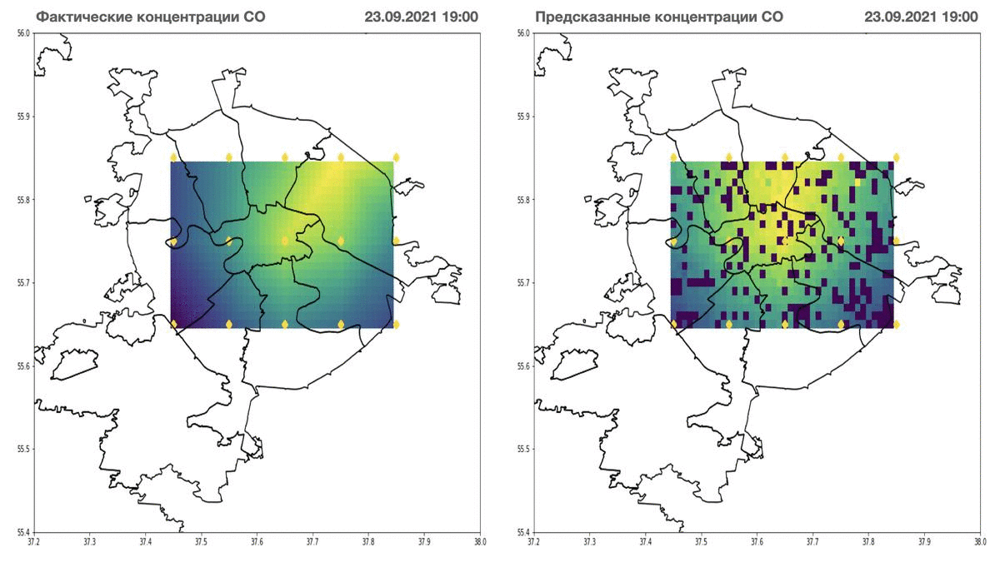

# air_tracer

В этом репозитории хранится исходный код по построению предиктивной модели на основе градиентного бустинга концентрации загрязняющих веществ (CO, NO2, NO, PM2.5, PM10) по городу Москва за 2020 календарный год рамках [задачи](https://leaders2021.innoagency.ru/04/) хакатона ЛЦТ. А также исходный код по моделированию распространения загрязняющих веществ на территории города Москва.

Для моделирования загрязняющих вещества по территории города была впервые применена уникальная архитектура нейронной сети на основе модифицированных автоэнкодеров. Процесс обучения проходил в два шага:

1. Интерполяция данных со спутниковых снимков космической программы [Copernicus](https://ads.atmosphere.copernicus.eu/#!/home)
2. Прогон модели на парах векторов (измерения со спутника и с датчиков)

Архитектура сети - 4 линейных слоя с активационными функциями reLu. Размерность каждого слоя следующая: 60-128-256-800. Нейросеть продемонстрировала хорошую способность к воспроизведению динамики движения газа СО в атмосфере города: 

<p align="center">

</p>


## Базовое использование предиктора

Скачайте и настроение виртуальное окружение: 

```terminal
git clone https://github.com/cut4cut/air_tracer.git
cd air_tracer
python -m venv venv
. venv/bin/acivate
pip install -r requirements.txt
```

Для запуска обучения достаточно ввести комманду:

```terminal
python air_tracer -f y -d <путь к папке с данными> -s <путь к папке, где сохранить модель>
```

Для тестовго предсказания c дефольтными параметрами:

```terminal
python air_tracer -f n
```

Чтобы получить предсказания по NO для поста 'Марьино' на момент времени 21-09-2021 15:00:

```terminal
python air_tracer -f n -a "Марьино" "NO" "21-09-2021 15:00"
```

Также можно запросить описание всех комманд:

```terminal
python air_tracer -h
```
Решение собиралось и тестировалось на macOS 10.15.7 (19H1419) 1,6 GHz 2‑ядерный процессор Intel Core i5.


